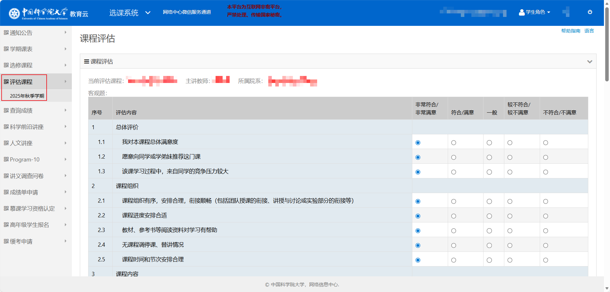
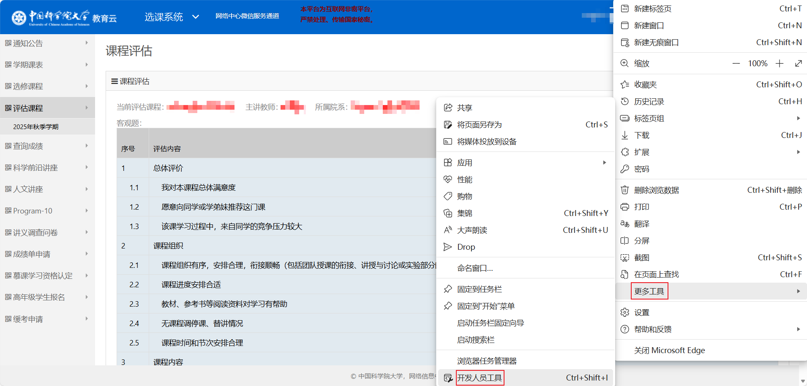
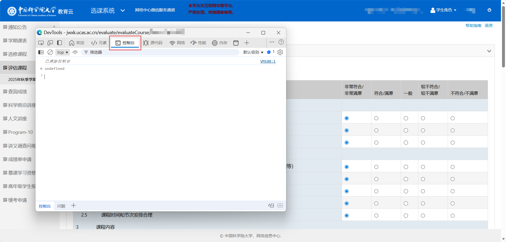
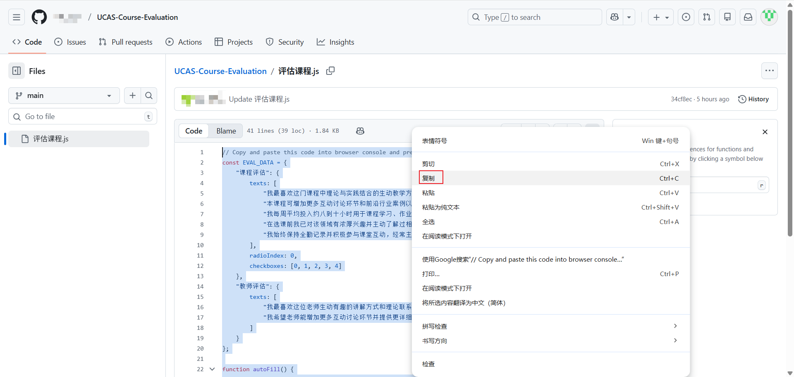
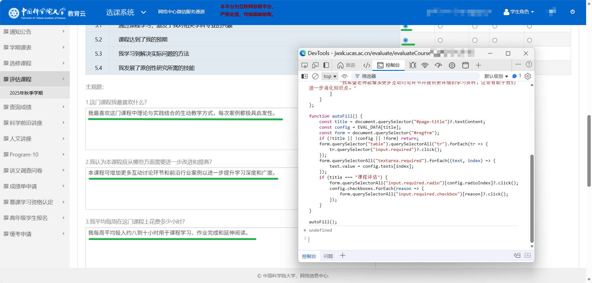

# 🎓 UCAS 课程评估一键填写脚本

一个 **为中国科学院大学（UCAS / 国科大）选课系统评价模块量身打造的小工具** ✨  
帮助你在课程评估阶段 **快速、自动、稳定地完成填写**，告别机械式的重复痛苦输入🤩

> 🧩 **无需安装插件**  
> ✨ **无需配置环境**  
> 🌐 **浏览器控制台直接运行**  
> 📋 **复制 → 粘贴 → 回车 → 完成**

适合所有人，尤其适合：  
- ⏰ 临近 DDL 的你  
- 😴 不想重复写评语的你  
- 🐣 完全不懂前端/自动化的小白  

---

## 🚀 项目作用

本项目通过一段轻量级 JavaScript 脚本：

- 自动勾选必选项  
- 自动填写课程 & 教师评估文字内容  
- 智能匹配当前评估页面  
- 几秒钟完成整页评估  

一句话总结：  
> **让课程评估从 10 分钟 → 10 秒钟** ⚡

---

## 🧭 使用教程（超详细，小白友好）

### Step 1️⃣：进入课程评估页面

打开 **国科大选课系统**，进入你要填写的：  
- 「课程评估」或  
- 「教师评估」页面  

📸 示例截图：  

---

### Step 2️⃣：打开浏览器控制台

在评估页面中：

- **Windows / Linux**：`F12` 或 `Ctrl + Shift + I`
- **macOS**：`Command + Option + I`

然后切换到 **Console（控制台）** 标签页

📸 示例截图：  

---

### Step 3️⃣：复制代码并粘贴运行

1. 打开本仓库中的脚本文件  
2. **全选复制代码**
3. 粘贴到浏览器控制台  
4. 按下 **Enter 回车键**

📸 示例截图：  

---

### Step 4️⃣：完成 🎉

此时你会看到：

- 所有必填项已自动勾选 ✅  
- 文本框已自动填写 ✍️  
- 页面无需刷新 📄  

📸 最终效果示意：  

确认无误，**填写验证码后直接提交即可** 🚀

---

## 🧠 原理说明（可选阅读）

- 通过 DOM 查询定位表单元素  
- 自动触发点击 & 填充文本  
- 根据页面标题区分「课程评估 / 教师评估」  
- 不收集、不上传任何数据，**仅在本地运行** 🔒  

---

## ⚠️ 注意事项

- 请在 **评估页面完全加载完成后** 再运行脚本  
- 如果学校系统页面结构更新，脚本可能需要微调  
- 本项目仅用于 **学习交流 & 合理使用**  

---

## 🌟 小彩蛋

如果这个项目帮你节省了时间：  
- ⭐ 给个 Star  
- 🤝 欢迎 Fork / PR  
- 📢 分享给同样被评估折磨的同学  

祝你：  
> **评估无压力，DDL 不再怕！** 🎯😆
